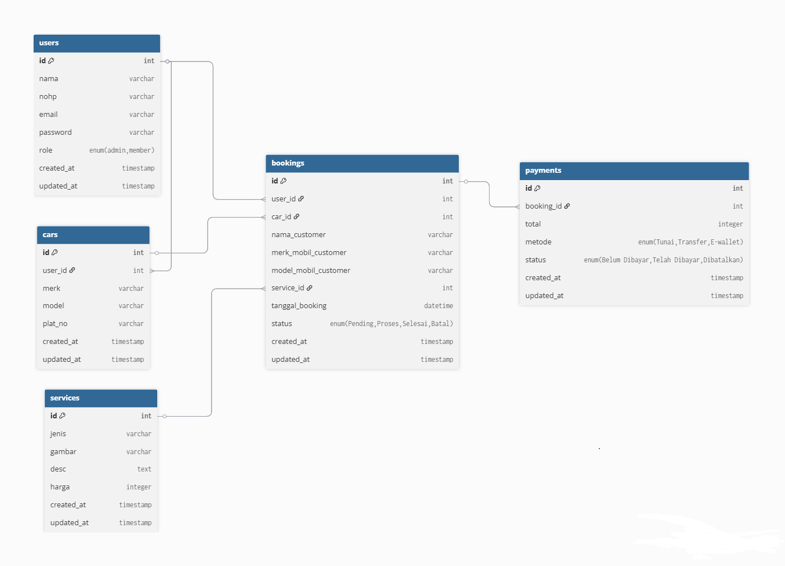

# Car Wash Booking - Backend (Laravel 12)

## Deskripsi
Project ini dibuat sebagai challenge untuk posisi **Backend Laravel Developer Intern**.  
Tujuan project adalah merancang **ERD (Entity Relationship Diagram)** dan mengimplementasikannya ke dalam **Laravel 12 migration** untuk sistem pemesanan jasa cuci mobil (Car Wash Booking).

---

## Fitur Utama
- **Booking tanpa login** -> customer cukup input data mobil.
- **Member login** -> dengan benefit sebagai member dapat melihat riwayat transaksi.
- **Riwayat booking** untuk setiap member.
- **Manajemen data mobil** untuk member.

---

## ERD Diagram 

Alur Database
- **Users**: menyimpan data member & admin.
- **Cars**: menyimpan data mobil milik member.
- **Bookings**: menyimpan data pemesanan cuci mobil.
- **Payments**: menyimpan status pembayaran booking.

Relasi utama:
- `User` hasMany `Cars`
- `User` hasMany `Bookings`
- `Booking` hasOne `Payment`
- `Booking` belongsTo `User`
- `Car` belongsTo `User`

---

## Tech Stack
- Laravel 12
- Bootstrap 5
- MySQL
